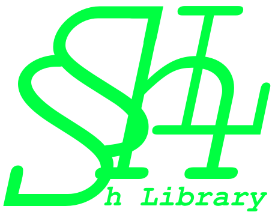

    

# Shell Script Library - ShSL

Collection of Shell Script functions for abstracting the development process, speed up the productivity and clear the source code to be read like a human being not like a machine.

## Description

### Reasons to use **Shell Script Library**

- Benefits
    1. [x] **Shell Script Library** turns your scripts safer and more portable.
        > The source code is more than 90% compatible with `POSIX` and we are working to reach the 100%.

    1. [x] The function were built using static types from Cotowali.
        > The static types are going be preserved **only** in case you keep develop using Cotowali programming language.

    1. [x] Easy implementation setup.
        > All functions are up be imported from declaring only one single line. Local or online file.
    
    1. [x] You can static the **Shell Script Library** version your project should use.
        > In case of deprecated functions on the newest updates, all the older versions are still available to be consulted or downloaded by set the specific version up.

        > In case of setup up the latest version, the functions are going to be updated automatic by generate your own source code.
    
    1. [x] **Shell Script Library** source code follows the clear code philosophy.
        > Functions names have detailed description defined on their own names. It reduces the number of lines by removing the unneeded commentaries whose would describe what each command does.
        
        > Each function does one action and each one of them returns only what it is expected (nothing more, nothing less).

    1. [x] Shortcuts commands.
        > Some commands could be a little long to type and remember. So, we have created some shortcuts to easily implementation while developing your own scripts.

### Warnings

1. **Shell Script Library** has the intention to provide an entire ecosystem whose understand the action is set to be done with a few commands but looking for the best possible scenario to solve the problem.

1. Have in mind some Shell Script commands may change according to the operating system. The **Shell Script Library** understands this problem exists and works hard for providing a unique interface. In others words, the developer does not need to think in every possible scenario whose his script file will be run. Bit by bit this library is implementing solutions to solve this kind of problem.

1. Once your source code is developed using the **Shell Script Library** you do not to worry about updates breaks up. You can set a specific version from this library or even use the latest one available. Using the latest one may be not recommended for production but the biggest advantage is coding using `Cotowali` programming language and be able to receive new feature and fix issues without changing a single line from the source code.

1. Besides the **Shell Script Library** pursuits the `POSIX`. By the way all the implemented functions have been tested so far **only** on `Linux` platform. But the syntax we are developing the source code is following the `POSIX` compatible (only in specifics cases we are still `Bashism` but we are going to refactor it). In the future we have plans to test the functions on `BSD` and `MacOS` before we test on `Windows` platform.

## Final words 

- The step by step to the happiness:
    1. [x] Import the **Shell Script Library**.
    1. [x] Code less and better by using the **Shell Script Library**.
    1. [x] Get all the hard work done with a few steps.
    1. [x] Smile! You have saved time by enjoying this robust ecosystem whose have tested methods for improving the securance.